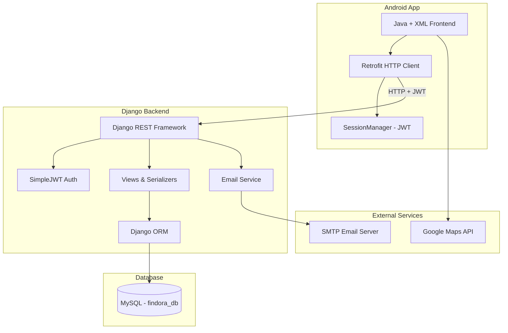
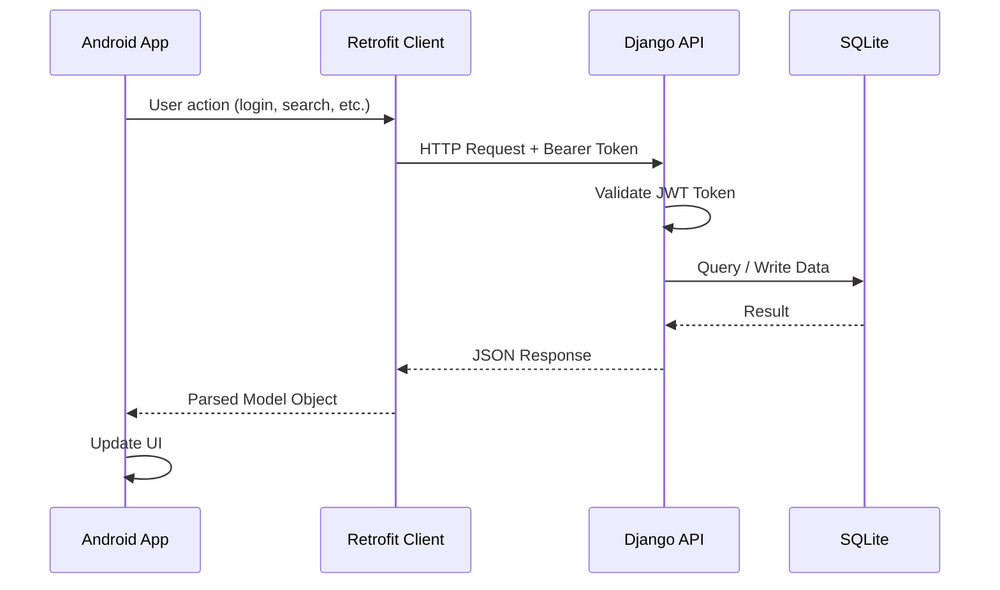
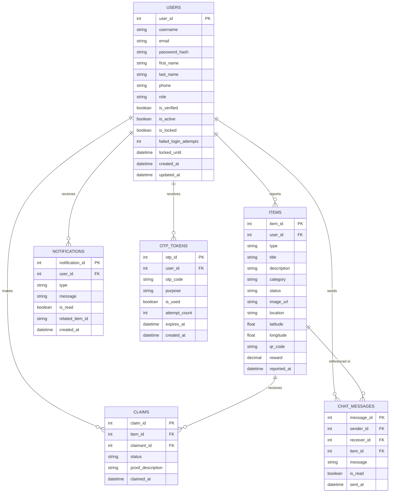
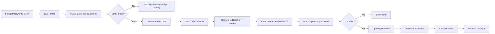
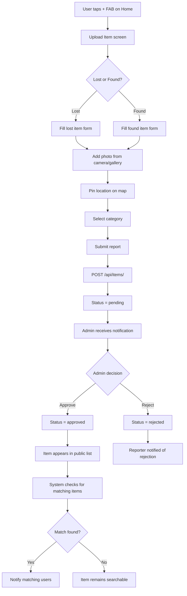
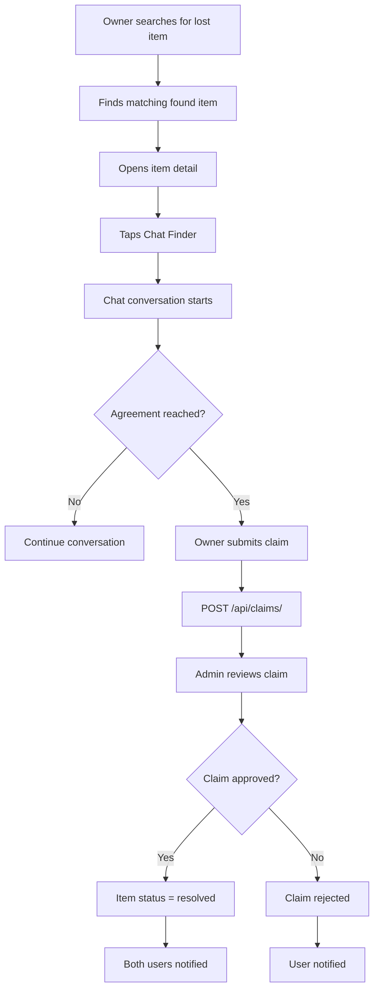

# FINDORA — Lost & Found Management App
## Master Development Blueprint & Implementation Guide
---

## Table of Contents

1. [Project Overview](#1-project-overview)
2. [Architecture Overview](#2-architecture-overview)
3. [Tech Stack Reference](#3-tech-stack-reference)
4. [Database Design](#4-database-design)
5. [Authentication System](#5-authentication-system)
6. [API Design & Endpoints](#6-api-design--endpoints)
7. [User Flow Diagrams](#7-user-flow-diagrams)
8. [Django Admin Configuration](#8-django-admin-configuration)
9. [Security Implementation](#9-security-implementation)
10. [Android App Implementation](#10-android-app-implementation)
11. [Feature Implementation Guide](#11-feature-implementation-guide)
12. [Error Handling Strategy](#12-error-handling-strategy)
13. [Testing Checklist](#13-testing-checklist)
14. [Development Guidelines](#14-development-guidelines)
15. [Deployment Considerations](#15-deployment-considerations)

---

## 1. Project Overview

### 1.1 Problem Statement
Losing valuable items such as wallets, phones, documents, ID cards, keys, and bags is a common problem in schools, colleges, offices, malls, airports, and public places. Traditional lost-and-found systems rely on manual registers, notice boards, social media posts, or word-of-mouth — all slow, unorganized, insecure, and inefficient.

### 1.2 Solution
**Findora** is a smart, secure, user-friendly Lost & Found Management App that helps users report, search, verify, and recover lost items efficiently using modern technologies.

### 1.3 User Roles

| Role | Description | Permissions |
|------|-------------|-------------|
| **Owner** | Person who lost an item | Report lost, search, chat, claim, notifications |
| **Finder** | Person who found an item | Report found, search, chat, notifications |
| **Admin** | Platform moderator | Verify reports, manage users, view analytics (Django Admin only) |

### 1.4 Core Features

#### Basic Features
- [x] Secure registration with email OTP verification
- [x] JWT-based login/logout with refresh tokens
- [x] Report lost or found items with images
- [x] Search and filter items by category, type, location
- [x] Real-time chat between owner and finder
- [x] Push notifications for matches and approvals
- [x] Admin verification panel (Django Admin)

#### Advanced Features
- [ ] Voice search using SpeechRecognizer
- [ ] QR code generation and scanning for item verification
- [ ] Google Maps location pinning
- [ ] Reward/bounty system for found items
- [ ] Emergency contact SMS notification
- [ ] Dark mode toggle
- [ ] Analytics dashboard (Django Admin)
- [ ] Account lock after failed login attempts
- [ ] Password reset via email OTP

---

## 2. Architecture Overview

### 2.1 System Architecture



### 2.2 Request-Response Flow



### 2.3 Folder Structure

## 3. Tech Stack Reference

### 3.1 Backend

| Technology| Purpose |
|-----------|---------|---------|

| Django | Web framework |
| Django REST Framework |  REST API |
| djangorestframework-simplejwt | JWT authentication |

### 3.2 Frontend (Android)

| Technology | Purpose |
|-----------|---------|
| Java | Programming language |
| XML | UI layout |
| Android SDK | Android platform |
| Retrofit | HTTP client |
| OkHttp | HTTP interceptor |
| Gson | JSON parsing |
| Glide | Image loading |
| Material Design | UI components |
| ZXing | QR code scanning |

### 3.3 Database

| Table | Purpose |
|-------|---------|
| users | All user accounts (owners, finders, admins) |
| items | Lost and found item reports |
| claims | Ownership claims on found items |
| chat_messages | Conversations between users |
| notifications | System alerts and updates |
| otp_tokens | OTP records for email verification and password reset |

---

## 4. Database Design

### 4.1 Entity Relationship Diagram



### 4.2 Complete Django Models (`api/models.py`)

```python
from django.db import models
from django.contrib.auth.models import AbstractUser
from django.utils import timezone
import secrets
import string


class User(AbstractUser):
    ROLE_CHOICES = [
        ('owner', 'Owner'),
        ('finder', 'Finder'),
        ('admin', 'Admin'),
    ]
    phone = models.CharField(max_length=15, blank=True)
    role = models.CharField(max_length=10, choices=ROLE_CHOICES, default='owner')
    is_verified = models.BooleanField(default=False)
    failed_login_attempts = models.IntegerField(default=0)
    is_locked = models.BooleanField(default=False)
    locked_until = models.DateTimeField(null=True, blank=True)
    emergency_contact_name = models.CharField(max_length=100, blank=True)
    emergency_contact_phone = models.CharField(max_length=15, blank=True)
    profile_image = models.ImageField(upload_to='profiles/', blank=True, null=True)
    created_at = models.DateTimeField(auto_now_add=True)
    updated_at = models.DateTimeField(auto_now=True)

    class Meta:
        db_table = 'users'
        verbose_name = 'User'
        verbose_name_plural = 'Users'

    def __str__(self):
        return f"{self.get_full_name()} ({self.role})"

    def is_account_locked(self):
        if self.is_locked and self.locked_until:
            if timezone.now() < self.locked_until:
                return True
            else:
                # Auto-unlock after lock duration
                self.is_locked = False
                self.failed_login_attempts = 0
                self.locked_until = None
                self.save()
        return False

    def increment_failed_attempts(self):
        self.failed_login_attempts += 1
        if self.failed_login_attempts >= 5:
            self.is_locked = True
            self.locked_until = timezone.now() + timezone.timedelta(minutes=30)
        self.save()

    def reset_failed_attempts(self):
        self.failed_login_attempts = 0
        self.is_locked = False
        self.locked_until = None
        self.save()


class OTPToken(models.Model):
    PURPOSE_CHOICES = [
        ('email_verify', 'Email Verification'),
        ('password_reset', 'Password Reset'),
    ]
    user = models.ForeignKey(User, on_delete=models.CASCADE, related_name='otp_tokens')
    otp_code = models.CharField(max_length=6)
    purpose = models.CharField(max_length=20, choices=PURPOSE_CHOICES)
    is_used = models.BooleanField(default=False)
    attempt_count = models.IntegerField(default=0)
    expires_at = models.DateTimeField()
    created_at = models.DateTimeField(auto_now_add=True)

    class Meta:
        db_table = 'otp_tokens'
        verbose_name = 'OTP Token'

    def is_valid(self):
        return (
            not self.is_used and
            self.attempt_count < 5 and
            timezone.now() < self.expires_at
        )

    def increment_attempt(self):
        self.attempt_count += 1
        self.save()

    @classmethod
    def generate_otp(cls):
        return ''.join(secrets.choice(string.digits) for _ in range(6))

    def __str__(self):
        return f"OTP for {self.user.email} ({self.purpose})"


class Item(models.Model):
    TYPE_CHOICES = [('lost', 'Lost'), ('found', 'Found')]
    STATUS_CHOICES = [
        ('pending', 'Pending'),
        ('approved', 'Approved'),
        ('resolved', 'Resolved'),
        ('rejected', 'Rejected'),
    ]
    CATEGORY_CHOICES = [
        ('wallet', 'Wallet'),
        ('phone', 'Phone'),
        ('keys', 'Keys'),
        ('bag', 'Bag'),
        ('id_card', 'ID Card'),
        ('documents', 'Documents'),
        ('electronics', 'Electronics'),
        ('other', 'Other'),
    ]
    user = models.ForeignKey(User, on_delete=models.CASCADE, related_name='items')
    type = models.CharField(max_length=5, choices=TYPE_CHOICES)
    title = models.CharField(max_length=200)
    description = models.TextField(blank=True)
    category = models.CharField(max_length=20, choices=CATEGORY_CHOICES)
    status = models.CharField(max_length=10, choices=STATUS_CHOICES, default='pending')
    image = models.ImageField(upload_to='items/', blank=True, null=True)
    location = models.CharField(max_length=255, blank=True)
    latitude = models.FloatField(null=True, blank=True)
    longitude = models.FloatField(null=True, blank=True)
    qr_code = models.CharField(max_length=100, blank=True)
    reward = models.DecimalField(max_digits=10, decimal_places=2, default=0)
    reported_at = models.DateTimeField(auto_now_add=True)
    updated_at = models.DateTimeField(auto_now=True)

    class Meta:
        db_table = 'items'
        ordering = ['-reported_at']

    def __str__(self):
        return f"[{self.type.upper()}] {self.title} — {self.status}"


class Claim(models.Model):
    STATUS_CHOICES = [
        ('pending', 'Pending'),
        ('approved', 'Approved'),
        ('rejected', 'Rejected'),
    ]
    item = models.ForeignKey(Item, on_delete=models.CASCADE, related_name='claims')
    claimant = models.ForeignKey(User, on_delete=models.CASCADE, related_name='claims')
    status = models.CharField(max_length=10, choices=STATUS_CHOICES, default='pending')
    proof_description = models.TextField(blank=True)
    claimed_at = models.DateTimeField(auto_now_add=True)

    class Meta:
        db_table = 'claims'

    def __str__(self):
        return f"Claim by {self.claimant.username} on {self.item.title}"


class ChatMessage(models.Model):
    sender = models.ForeignKey(User, on_delete=models.CASCADE, related_name='sent_messages')
    receiver = models.ForeignKey(User, on_delete=models.CASCADE, related_name='received_messages')
    item = models.ForeignKey(Item, on_delete=models.CASCADE, related_name='messages')
    message = models.TextField()
    is_read = models.BooleanField(default=False)
    sent_at = models.DateTimeField(auto_now_add=True)

    class Meta:
        db_table = 'chat_messages'
        ordering = ['sent_at']

    def __str__(self):
        return f"{self.sender.username} → {self.receiver.username}: {self.message[:40]}"


class Notification(models.Model):
    TYPE_CHOICES = [
        ('match', 'Match Found'),
        ('approved', 'Report Approved'),
        ('rejected', 'Report Rejected'),
        ('message', 'New Message'),
        ('claim', 'Claim Update'),
    ]
    user = models.ForeignKey(User, on_delete=models.CASCADE, related_name='notifications')
    type = models.CharField(max_length=20, choices=TYPE_CHOICES)
    message = models.TextField()
    is_read = models.BooleanField(default=False)
    related_item = models.ForeignKey(Item, on_delete=models.SET_NULL, null=True, blank=True)
    created_at = models.DateTimeField(auto_now_add=True)

    class Meta:
        db_table = 'notifications'
        ordering = ['-created_at']

    def __str__(self):
        return f"Notification for {self.user.username}: {self.type}"
```

---

## 5. Authentication System

### 5.1 Authentication Flow Overview

```mermaid
flowchart TD
    A([User opens app]) --> B{Is logged in?}
    B -->|Yes - valid token| C[Home Screen]
    B -->|No| D[Login Screen]

    D --> E{New user?}
    E -->|Yes| F[Register Screen]
    E -->|No| G[Enter credentials]

    F --> H[Fill registration form]
    H --> I[POST /api/register/]
    I --> J{Valid data?}
    J -->|No| K[Show validation errors]
    K --> H
    J -->|Yes| L[Create inactive account]
    L --> M[Generate 6-digit OTP]
    M --> N[Send OTP to email]
    N --> O[Redirect to OTP Verify screen]

    O --> P[User enters OTP]
    P --> Q{OTP valid?}
    Q -->|Expired| R[Show expired message]
    R --> S[Resend OTP option]
    S --> M
    Q -->|Wrong - attempt < 5| T[Show error + remaining attempts]
    T --> P
    Q -->|Wrong - attempt >= 5| U[OTP locked - resend only]
    Q -->|Correct| V[Activate account]
    V --> W[Redirect to Login]

    G --> X[POST /api/login/]
    X --> Y{Account active?}
    Y -->|Not verified| Z[Show "Please verify email"]
    Y -->|Locked| AA[Show lock message + time]
    Y -->|Active| AB{Credentials correct?}
    AB -->|No| AC[Increment failed attempts]
    AC --> AD{Attempts >= 5?}
    AD -->|Yes| AE[Lock account 30 mins]
    AD -->|No| AF[Show error]
    AB -->|Yes| AG[Reset failed attempts]
    AG --> AH[Return JWT access + refresh]
    AH --> AI[Save token in SessionManager]
    AI --> C
```

### 5.2 Registration Endpoint

**URL:** `POST /api/register/`
**Auth:** None required

**Request Body:**
```json
{
  "username": "bivek_kafle",
  "email": "bivek@email.com",
  "password": "SecurePass123!",
  "first_name": "Bivek",
  "last_name": "Kafle",
  "phone": "9800000000",
  "role": "owner"
}
```

**Validation Rules:**
- `username`: 3–30 chars, alphanumeric + underscore only, unique
- `email`: valid format, unique in database
- `password`: min 8 chars, at least 1 uppercase, 1 number, 1 special char
- `phone`: 10 digits, numeric only
- `role`: must be `owner` or `finder` (admin cannot self-register)

**Success Response (201):**
```json
{
  "message": "Registration successful. Please check your email for OTP.",
  "email": "bivek@email.com"
}
```

**Error Response (400):**
```json
{
  "email": ["A user with this email already exists."],
  "password": ["Password must be at least 8 characters."]
}
```

### 5.3 Email OTP Verification Endpoint

**URL:** `POST /api/verify-otp/`
**Auth:** None required

**Request Body:**
```json
{
  "email": "bivek@email.com",
  "otp": "847291",
  "purpose": "email_verify"
}
```

**OTP Rules:**
- 6-digit numeric OTP
- Expires in **10 minutes**
- Maximum **5 wrong attempts** before OTP is locked
- Only 1 active OTP per user per purpose at a time
- Previous OTPs invalidated when new one is generated

**Success Response (200):**
```json
{
  "message": "Email verified successfully. You can now log in.",
  "verified": true
}
```

**Error Responses:**

| Code | Scenario | Message |
|------|----------|---------|
| 400 | Wrong OTP | "Invalid OTP. 3 attempts remaining." |
| 400 | Expired OTP | "OTP has expired. Please request a new one." |
| 400 | Max attempts | "Too many attempts. Please request a new OTP." |
| 404 | No OTP found | "No active OTP found for this email." |

### 5.4 Resend OTP Endpoint

**URL:** `POST /api/resend-otp/`
**Auth:** None required

**Request Body:**
```json
{
  "email": "bivek@email.com",
  "purpose": "email_verify"
}
```

**Cooldown Rules:**
- Minimum **60 seconds** between OTP resend requests
- Maximum **5 resend requests per hour** per email
- On resend: invalidate all previous OTPs for same user and purpose

**Success Response (200):**
```json
{
  "message": "New OTP sent to bivek@email.com",
  "expires_in": 600
}
```

**Rate Limit Response (429):**
```json
{
  "error": "Please wait 45 seconds before requesting a new OTP.",
  "retry_after": 45
}
```

### 5.5 Login Endpoint

**URL:** `POST /api/login/`
**Auth:** None required

**Request Body:**
```json
{
  "username": "bivek_kafle",
  "password": "SecurePass123!"
}
```

**Login Validation Sequence:**
1. Check if user exists
2. Check `is_verified` → if false, return 403
3. Check `is_account_locked()` → if true, return 423
4. Verify password → if wrong, call `increment_failed_attempts()`
5. If password correct → call `reset_failed_attempts()`
6. Generate and return JWT tokens

**Success Response (200):**
```json
{
  "user": {
    "id": 1,
    "username": "bivek_kafle",
    "email": "bivek@email.com",
    "first_name": "Bivek",
    "last_name": "Kafle",
    "phone": "9800000000",
    "role": "owner",
    "is_verified": true
  },
  "access": "eyJhbGciOiJIUzI1NiIsInR5cCI6IkpXVCJ9...",
  "refresh": "eyJhbGciOiJIUzI1NiIsInR5cCI6IkpXVCJ9..."
}
```

**Error Responses:**

| Code | Scenario | Message |
|------|----------|---------|
| 401 | Wrong credentials | "Invalid username or password." |
| 403 | Not verified | "Please verify your email before logging in." |
| 423 | Account locked | "Account locked. Try again after 25 minutes." |

### 5.6 Forgot Password Flow



**Forgot Password Endpoint:**
```
POST /api/forgot-password/
Body: { "email": "bivek@email.com" }
Response (200): { "message": "If this email exists, an OTP has been sent." }
```
> **Security Note:** Always return 200 regardless of whether email exists, to prevent email enumeration.

**Reset Password Endpoint:**
```
POST /api/reset-password/
Body: {
  "email": "bivek@email.com",
  "otp": "123456",
  "new_password": "NewPass123!",
  "confirm_password": "NewPass123!"
}
```

### 5.7 Change Password Endpoint

**URL:** `POST /api/change-password/`
**Auth:** Bearer JWT required

**Request Body:**
```json
{
  "current_password": "OldPass123!",
  "new_password": "NewPass456!",
  "confirm_password": "NewPass456!"
}
```

**Rules:**
- Must validate current password before allowing change
- New password must not be the same as current
- Invalidate all existing refresh tokens on success

### 5.8 JWT Token Configuration

Add to `settings.py`:
```python
from datetime import timedelta

SIMPLE_JWT = {
    'ACCESS_TOKEN_LIFETIME': timedelta(days=7),
    'REFRESH_TOKEN_LIFETIME': timedelta(days=30),
    'ROTATE_REFRESH_TOKENS': True,        # New refresh token on each use
    'BLACKLIST_AFTER_ROTATION': True,     # Old refresh token blacklisted
    'UPDATE_LAST_LOGIN': True,
    'ALGORITHM': 'HS256',
    'AUTH_HEADER_TYPES': ('Bearer',),
    'AUTH_HEADER_NAME': 'HTTP_AUTHORIZATION',
    'USER_ID_FIELD': 'id',
    'USER_ID_CLAIM': 'user_id',
}
```

Add `rest_framework_simplejwt.token_blacklist` to `INSTALLED_APPS` for token blacklisting.

### 5.9 Logout Endpoint

**URL:** `POST /api/logout/`
**Auth:** Bearer JWT required

**Request Body:**
```json
{
  "refresh": "eyJhbGciOiJIUzI1NiIsInR5cCI6IkpXVCJ9..."
}
```

**Action:** Blacklist the refresh token so it cannot be used again.

**Response (200):**
```json
{ "message": "Logged out successfully." }
```

### 5.10 Token Refresh Endpoint

**URL:** `POST /api/token/refresh/`
**Auth:** None required

**Request Body:**
```json
{
  "refresh": "eyJhbGciOiJIUzI1NiIsInR5cCI6IkpXVCJ9..."
}
```

**Response (200):**
```json
{
  "access": "eyJhbGciOiJIUzI1NiIsInR5cCI6IkpXVCJ9...",
  "refresh": "eyJhbGciOiJIUzI1NiIsInR5cCI6IkpXVCJ9..."
}
```

### 5.11 OTP Utility Functions (`api/utils.py`)

```python
import secrets
import string
from django.core.mail import send_mail
from django.utils import timezone
from django.conf import settings
from .models import OTPToken


def generate_otp(length=6):
    """Generate a secure numeric OTP."""
    return ''.join(secrets.choice(string.digits) for _ in range(length))


def create_otp(user, purpose):
    """Invalidate old OTPs and create a new one."""
    # Invalidate all previous active OTPs for same user and purpose
    OTPToken.objects.filter(
        user=user,
        purpose=purpose,
        is_used=False
    ).update(is_used=True)

    otp_code = generate_otp()
    otp = OTPToken.objects.create(
        user=user,
        otp_code=otp_code,
        purpose=purpose,
        expires_at=timezone.now() + timezone.timedelta(minutes=10)
    )
    return otp


def send_otp_email(user, otp_code, purpose):
    """Send OTP email to the user."""
    subject_map = {
        'email_verify': 'Findora — Verify Your Email',
        'password_reset': 'Findora — Password Reset OTP',
    }
    message_map = {
        'email_verify': (
            f"Hello {user.first_name},\n\n"
            f"Your email verification OTP is: {otp_code}\n\n"
            f"This OTP expires in 10 minutes.\n"
            f"Do not share this OTP with anyone.\n\n"
            f"— Findora Team"
        ),
        'password_reset': (
            f"Hello {user.first_name},\n\n"
            f"Your password reset OTP is: {otp_code}\n\n"
            f"This OTP expires in 10 minutes.\n"
            f"If you did not request this, please ignore this email.\n\n"
            f"— Findora Team"
        ),
    }
    send_mail(
        subject=subject_map.get(purpose, 'Findora OTP'),
        message=message_map.get(purpose, f"Your OTP: {otp_code}"),
        from_email=settings.DEFAULT_FROM_EMAIL,
        recipient_list=[user.email],
        fail_silently=False,
    )


def verify_otp(user, otp_code, purpose):
    """Verify OTP and return (success: bool, message: str)."""
    try:
        otp = OTPToken.objects.filter(
            user=user,
            purpose=purpose,
            is_used=False
        ).latest('created_at')
    except OTPToken.DoesNotExist:
        return False, "No active OTP found. Please request a new one."

    if not otp.is_valid():
        if timezone.now() >= otp.expires_at:
            return False, "OTP has expired. Please request a new one."
        if otp.attempt_count >= 5:
            return False, "Too many attempts. Please request a new OTP."

    if otp.otp_code != otp_code:
        otp.increment_attempt()
        remaining = 5 - otp.attempt_count
        return False, f"Invalid OTP. {remaining} attempt(s) remaining."

    otp.is_used = True
    otp.save()
    return True, "OTP verified successfully."
```

### 5.12 Email Settings (`settings.py`)

```python
# Development: Print emails to console
EMAIL_BACKEND = 'django.core.mail.backends.console.EmailBackend'

# Production: Use SMTP
# EMAIL_BACKEND = 'django.core.mail.backends.smtp.EmailBackend'
# EMAIL_HOST = 'smtp.gmail.com'
# EMAIL_PORT = 587
# EMAIL_USE_TLS = True
# EMAIL_HOST_USER = 'your-email@gmail.com'
# EMAIL_HOST_PASSWORD = 'your-app-password'
# DEFAULT_FROM_EMAIL = 'Findora <noreply@findora.com>'
```

### 5.13 Android Authentication Screens

#### VerifyOtpActivity Requirements
- 6 separate single-character EditText fields (OTP input boxes)
- Auto-focus moves to next box on character entry
- Auto-submit when all 6 digits entered
- Countdown timer (10:00 → 0:00) showing OTP expiry
- "Resend OTP" button — disabled until timer reaches 0 or after first attempt
- Resend button shows cooldown: "Resend in 00:45"
- Error message displays remaining attempts
- On success: navigate to LoginActivity with success toast

#### ForgotPasswordActivity Requirements
- Single email input field
- "Send Reset OTP" button
- On success: navigate to ResetPasswordActivity
- Generic success message regardless of email existence

#### ResetPasswordActivity Requirements
- OTP input (same 6-box UI as VerifyOtpActivity)
- New password field with show/hide toggle
- Confirm password field
- Password strength indicator (weak/medium/strong)
- On success: navigate to LoginActivity

---

## 6. API Design & Endpoints

### 6.1 Complete API Endpoint Table

| Method | Endpoint | Auth | Description |
|--------|----------|------|-------------|
| POST | `/api/register/` | None | Register new user |
| POST | `/api/verify-otp/` | None | Verify email OTP |
| POST | `/api/resend-otp/` | None | Resend OTP |
| POST | `/api/login/` | None | Login and get tokens |
| POST | `/api/logout/` | Bearer | Logout and blacklist token |
| POST | `/api/token/refresh/` | None | Refresh access token |
| POST | `/api/forgot-password/` | None | Request password reset OTP |
| POST | `/api/reset-password/` | None | Reset password with OTP |
| POST | `/api/change-password/` | Bearer | Change current password |
| GET | `/api/profile/` | Bearer | Get logged-in user profile |
| PUT | `/api/profile/` | Bearer | Update profile |
| GET | `/api/items/` | Bearer | List approved items |
| GET | `/api/items/?search=query` | Bearer | Search items |
| GET | `/api/items/?type=lost` | Bearer | Filter by type |
| GET | `/api/items/?category=phone` | Bearer | Filter by category |
| POST | `/api/items/` | Bearer | Report new item |
| GET | `/api/items/{id}/` | Bearer | Get item detail |
| PUT | `/api/items/{id}/` | Bearer | Update item (owner only) |
| DELETE | `/api/items/{id}/` | Bearer | Delete item (owner only) |
| GET | `/api/admin/items/` | Bearer + Admin | Pending items |
| POST | `/api/admin/items/{id}/verify/` | Bearer + Admin | Approve or reject |
| POST | `/api/claims/` | Bearer | Submit ownership claim |
| GET | `/api/chat/?item_id={id}` | Bearer | Get messages for item |
| POST | `/api/chat/` | Bearer | Send message |
| GET | `/api/notifications/` | Bearer | Get notifications |
| POST | `/api/notifications/{id}/read/` | Bearer | Mark as read |

### 6.2 Complete `api/urls.py`

```python
from django.urls import path
from rest_framework_simplejwt.views import TokenRefreshView
from . import views

urlpatterns = [
    # Authentication
    path('register/', views.RegisterView.as_view()),
    path('verify-otp/', views.VerifyOTPView.as_view()),
    path('resend-otp/', views.ResendOTPView.as_view()),
    path('login/', views.LoginView.as_view()),
    path('logout/', views.LogoutView.as_view()),
    path('token/refresh/', TokenRefreshView.as_view()),
    path('forgot-password/', views.ForgotPasswordView.as_view()),
    path('reset-password/', views.ResetPasswordView.as_view()),
    path('change-password/', views.ChangePasswordView.as_view()),

    # Profile
    path('profile/', views.ProfileView.as_view()),

    # Items
    path('items/', views.ItemListCreateView.as_view()),
    path('items/<int:pk>/', views.ItemDetailView.as_view()),

    # Admin
    path('admin/items/', views.AdminItemListView.as_view()),
    path('admin/items/<int:pk>/verify/', views.AdminVerifyItemView.as_view()),

    # Claims
    path('claims/', views.ClaimCreateView.as_view()),

    # Chat
    path('chat/', views.ChatListView.as_view()),

    # Notifications
    path('notifications/', views.NotificationListView.as_view()),
    path('notifications/<int:pk>/read/', views.MarkNotificationReadView.as_view()),
]
```

### 6.3 Complete `api/views.py`

```python
from rest_framework import status, generics, permissions
from rest_framework.response import Response
from rest_framework.views import APIView
from rest_framework_simplejwt.tokens import RefreshToken
from rest_framework_simplejwt.token_blacklist.models import OutstandingToken, BlacklistedToken
from django.contrib.auth import authenticate
from django.utils import timezone
from django.db.models import Q
from .models import User, Item, Claim, ChatMessage, Notification, OTPToken
from .serializers import *
from .utils import create_otp, send_otp_email, verify_otp


class RegisterView(APIView):
    permission_classes = [permissions.AllowAny]

    def post(self, request):
        serializer = RegisterSerializer(data=request.data)
        if serializer.is_valid():
            user = serializer.save()
            user.is_active = True       # Account is active but not verified
            user.is_verified = False
            user.save()

            # Create and send OTP
            otp = create_otp(user, 'email_verify')
            send_otp_email(user, otp.otp_code, 'email_verify')

            return Response({
                'message': 'Registration successful. Please check your email for OTP.',
                'email': user.email
            }, status=status.HTTP_201_CREATED)
        return Response(serializer.errors, status=status.HTTP_400_BAD_REQUEST)


class VerifyOTPView(APIView):
    permission_classes = [permissions.AllowAny]

    def post(self, request):
        email = request.data.get('email')
        otp_code = request.data.get('otp')
        purpose = request.data.get('purpose', 'email_verify')

        try:
            user = User.objects.get(email=email)
        except User.DoesNotExist:
            return Response({'error': 'User not found.'}, status=status.HTTP_404_NOT_FOUND)

        success, message = verify_otp(user, otp_code, purpose)
        if not success:
            return Response({'error': message}, status=status.HTTP_400_BAD_REQUEST)

        if purpose == 'email_verify':
            user.is_verified = True
            user.save()

        return Response({'message': message, 'verified': True})


class ResendOTPView(APIView):
    permission_classes = [permissions.AllowAny]

    def post(self, request):
        email = request.data.get('email')
        purpose = request.data.get('purpose', 'email_verify')

        try:
            user = User.objects.get(email=email)
        except User.DoesNotExist:
            return Response({'message': 'If this email exists, an OTP has been sent.'})

        # Cooldown: check last OTP creation time
        last_otp = OTPToken.objects.filter(user=user, purpose=purpose).last()
        if last_otp:
            elapsed = (timezone.now() - last_otp.created_at).seconds
            if elapsed < 60:
                return Response({
                    'error': f'Please wait {60 - elapsed} seconds before requesting a new OTP.',
                    'retry_after': 60 - elapsed
                }, status=status.HTTP_429_TOO_MANY_REQUESTS)

        otp = create_otp(user, purpose)
        send_otp_email(user, otp.otp_code, purpose)
        return Response({'message': f'New OTP sent to {email}', 'expires_in': 600})


class LoginView(APIView):
    permission_classes = [permissions.AllowAny]

    def post(self, request):
        username = request.data.get('username')
        password = request.data.get('password')

        try:
            user = User.objects.get(username=username)
        except User.DoesNotExist:
            return Response({'error': 'Invalid username or password.'},
                            status=status.HTTP_401_UNAUTHORIZED)

        # Check email verification
        if not user.is_verified:
            return Response({'error': 'Please verify your email before logging in.',
                             'email': user.email, 'action': 'verify'},
                            status=status.HTTP_403_FORBIDDEN)

        # Check account lock
        if user.is_account_locked():
            time_left = int((user.locked_until - timezone.now()).seconds / 60)
            return Response({'error': f'Account locked. Try again after {time_left} minute(s).'},
                            status=status.HTTP_423_LOCKED)

        # Verify password
        auth_user = authenticate(username=username, password=password)
        if not auth_user:
            user.increment_failed_attempts()
            remaining = 5 - user.failed_login_attempts
            if remaining <= 0:
                return Response({'error': 'Account locked due to too many failed attempts.'},
                                status=status.HTTP_423_LOCKED)
            return Response({'error': f'Invalid username or password. {remaining} attempt(s) left.'},
                            status=status.HTTP_401_UNAUTHORIZED)

        user.reset_failed_attempts()
        refresh = RefreshToken.for_user(user)
        return Response({
            'user': UserSerializer(user).data,
            'access': str(refresh.access_token),
            'refresh': str(refresh),
        })


class LogoutView(APIView):
    permission_classes = [permissions.IsAuthenticated]

    def post(self, request):
        try:
            refresh_token = request.data.get('refresh')
            token = RefreshToken(refresh_token)
            token.blacklist()
            return Response({'message': 'Logged out successfully.'})
        except Exception:
            return Response({'error': 'Invalid token.'}, status=status.HTTP_400_BAD_REQUEST)


class ForgotPasswordView(APIView):
    permission_classes = [permissions.AllowAny]

    def post(self, request):
        email = request.data.get('email')
        try:
            user = User.objects.get(email=email)
            otp = create_otp(user, 'password_reset')
            send_otp_email(user, otp.otp_code, 'password_reset')
        except User.DoesNotExist:
            pass  # Silent - prevent email enumeration
        return Response({'message': 'If this email exists, an OTP has been sent.'})


class ResetPasswordView(APIView):
    permission_classes = [permissions.AllowAny]

    def post(self, request):
        email = request.data.get('email')
        otp_code = request.data.get('otp')
        new_password = request.data.get('new_password')
        confirm_password = request.data.get('confirm_password')

        if new_password != confirm_password:
            return Response({'error': 'Passwords do not match.'}, status=400)

        try:
            user = User.objects.get(email=email)
        except User.DoesNotExist:
            return Response({'error': 'User not found.'}, status=404)

        success, message = verify_otp(user, otp_code, 'password_reset')
        if not success:
            return Response({'error': message}, status=400)

        user.set_password(new_password)
        user.save()
        return Response({'message': 'Password reset successfully. Please log in.'})


class ChangePasswordView(APIView):
    permission_classes = [permissions.IsAuthenticated]

    def post(self, request):
        current_password = request.data.get('current_password')
        new_password = request.data.get('new_password')
        confirm_password = request.data.get('confirm_password')

        if not request.user.check_password(current_password):
            return Response({'error': 'Current password is incorrect.'}, status=400)

        if new_password != confirm_password:
            return Response({'error': 'Passwords do not match.'}, status=400)

        if current_password == new_password:
            return Response({'error': 'New password must be different.'}, status=400)

        request.user.set_password(new_password)
        request.user.save()
        return Response({'message': 'Password changed successfully. Please log in again.'})
```

### 6.4 Complete `api/serializers.py`

```python
from rest_framework import serializers
from django.contrib.auth.password_validation import validate_password
from .models import User, Item, Claim, ChatMessage, Notification


class UserSerializer(serializers.ModelSerializer):
    class Meta:
        model = User
        fields = ['id', 'username', 'email', 'phone', 'role',
                  'first_name', 'last_name', 'is_verified', 'created_at']
        read_only_fields = ['is_verified', 'created_at']


class RegisterSerializer(serializers.ModelSerializer):
    password = serializers.CharField(write_only=True, validators=[validate_password])
    confirm_password = serializers.CharField(write_only=True)

    class Meta:
        model = User
        fields = ['username', 'email', 'password', 'confirm_password',
                  'first_name', 'last_name', 'phone', 'role']

    def validate(self, data):
        if data['password'] != data.pop('confirm_password'):
            raise serializers.ValidationError({'confirm_password': 'Passwords do not match.'})
        if data.get('role') == 'admin':
            raise serializers.ValidationError({'role': 'Cannot register as admin.'})
        return data

    def create(self, validated_data):
        return User.objects.create_user(**validated_data)


class ItemSerializer(serializers.ModelSerializer):
    user_name = serializers.SerializerMethodField()
    user_role = serializers.SerializerMethodField()

    class Meta:
        model = Item
        fields = '__all__'
        read_only_fields = ['user', 'reported_at', 'updated_at']

    def get_user_name(self, obj):
        return obj.user.get_full_name() or obj.user.username

    def get_user_role(self, obj):
        return obj.user.role


class ClaimSerializer(serializers.ModelSerializer):
    class Meta:
        model = Claim
        fields = '__all__'
        read_only_fields = ['claimant', 'claimed_at']


class ChatMessageSerializer(serializers.ModelSerializer):
    sender_name = serializers.SerializerMethodField()
    sender_role = serializers.SerializerMethodField()

    class Meta:
        model = ChatMessage
        fields = '__all__'
        read_only_fields = ['sender', 'sent_at']

    def get_sender_name(self, obj):
        return obj.sender.get_full_name() or obj.sender.username

    def get_sender_role(self, obj):
        return obj.sender.role


class NotificationSerializer(serializers.ModelSerializer):
    class Meta:
        model = Notification
        fields = '__all__'
        read_only_fields = ['user', 'created_at']
```

---

## 7. User Flow Diagrams

### 7.1 Item Reporting Flow



### 7.2 Item Recovery Flow



---

## 8. Django Admin Configuration

> **Note:** Findora uses **only Django's default admin panel** — no custom admin frontend is built. The following configuration improves the default Django admin for this project.

### 8.1 Complete `api/admin.py`

```python
from django.contrib import admin
from django.contrib.auth.admin import UserAdmin
from django.utils.html import format_html
from django.utils import timezone
from .models import User, Item, Claim, ChatMessage, Notification, OTPToken


# ─── User Admin ───────────────────────────────────────────────
@admin.register(User)
class FindoraUserAdmin(UserAdmin):
    list_display = [
        'username', 'email', 'full_name', 'role',
        'is_verified', 'is_locked', 'failed_login_attempts',
        'is_active', 'created_at'
    ]
    list_filter = ['role', 'is_verified', 'is_locked', 'is_active', 'created_at']
    search_fields = ['username', 'email', 'first_name', 'last_name', 'phone']
    ordering = ['-created_at']
    readonly_fields = ['created_at', 'updated_at', 'last_login', 'failed_login_attempts']
    list_per_page = 25

    fieldsets = (
        ('Account Info', {
            'fields': ('username', 'email', 'password')
        }),
        ('Personal Info', {
            'fields': ('first_name', 'last_name', 'phone', 'role', 'profile_image')
        }),
        ('Emergency Contact', {
            'fields': ('emergency_contact_name', 'emergency_contact_phone'),
            'classes': ('collapse',)
        }),
        ('Status & Security', {
            'fields': (
                'is_active', 'is_verified', 'is_locked', 'locked_until',
                'failed_login_attempts'
            )
        }),
        ('Permissions', {
            'fields': ('is_staff', 'is_superuser', 'groups', 'user_permissions'),
            'classes': ('collapse',)
        }),
        ('Timestamps', {
            'fields': ('last_login', 'created_at', 'updated_at'),
            'classes': ('collapse',)
        }),
    )

    actions = ['verify_users', 'unlock_users', 'deactivate_users']

    def full_name(self, obj):
        return obj.get_full_name() or '—'
    full_name.short_description = 'Full Name'

    def verify_users(self, request, queryset):
        updated = queryset.update(is_verified=True)
        self.message_user(request, f'{updated} user(s) verified.')
    verify_users.short_description = 'Mark selected users as verified'

    def unlock_users(self, request, queryset):
        queryset.update(is_locked=False, failed_login_attempts=0, locked_until=None)
        self.message_user(request, 'Selected accounts unlocked.')
    unlock_users.short_description = 'Unlock selected accounts'

    def deactivate_users(self, request, queryset):
        queryset.update(is_active=False)
        self.message_user(request, 'Selected accounts deactivated.')
    deactivate_users.short_description = 'Deactivate selected users'


# ─── Item Admin ───────────────────────────────────────────────
class ClaimInline(admin.TabularInline):
    model = Claim
    extra = 0
    readonly_fields = ['claimant', 'status', 'proof_description', 'claimed_at']
    can_delete = False


@admin.register(Item)
class ItemAdmin(admin.ModelAdmin):
    list_display = [
        'title', 'type_badge', 'category', 'status_badge',
        'reporter', 'location', 'reward_display', 'reported_at'
    ]
    list_filter = ['type', 'status', 'category', 'reported_at']
    search_fields = ['title', 'description', 'location', 'user__username', 'user__email']
    ordering = ['-reported_at']
    readonly_fields = ['user', 'reported_at', 'updated_at', 'qr_code', 'image_preview']
    list_per_page = 20
    inlines = [ClaimInline]

    fieldsets = (
        ('Item Info', {
            'fields': ('user', 'type', 'title', 'description', 'category')
        }),
        ('Status & Reward', {
            'fields': ('status', 'reward')
        }),
        ('Location', {
            'fields': ('location', 'latitude', 'longitude')
        }),
        ('Media', {
            'fields': ('image', 'image_preview', 'qr_code')
        }),
        ('Timestamps', {
            'fields': ('reported_at', 'updated_at'),
            'classes': ('collapse',)
        }),
    )

    actions = ['approve_items', 'reject_items', 'mark_resolved']

    def type_badge(self, obj):
        color = '#D85A30' if obj.type == 'lost' else '#1D9E75'
        return format_html('<span style="background:{};color:white;padding:2px 8px;border-radius:4px">{}</span>',
                           color, obj.type.upper())
    type_badge.short_description = 'Type'

    def status_badge(self, obj):
        colors = {'pending': '#854F0B', 'approved': '#1D9E75', 'resolved': '#534AB7', 'rejected': '#D85A30'}
        color = colors.get(obj.status, '#666')
        return format_html('<span style="background:{};color:white;padding:2px 8px;border-radius:4px">{}</span>',
                           color, obj.status.upper())
    status_badge.short_description = 'Status'

    def reporter(self, obj):
        return f"{obj.user.get_full_name()} ({obj.user.role})"
    reporter.short_description = 'Reported By'

    def reward_display(self, obj):
        return f"Rs. {obj.reward}" if obj.reward > 0 else '—'
    reward_display.short_description = 'Reward'

    def image_preview(self, obj):
        if obj.image:
            return format_html('', obj.image.url)
        return '—'
    image_preview.short_description = 'Image Preview'

    def approve_items(self, request, queryset):
        queryset.update(status='approved')
        self.message_user(request, f'{queryset.count()} item(s) approved.')
    approve_items.short_description = 'Approve selected items'

    def reject_items(self, request, queryset):
        queryset.update(status='rejected')
        self.message_user(request, f'{queryset.count()} item(s) rejected.')
    reject_items.short_description = 'Reject selected items'

    def mark_resolved(self, request, queryset):
        queryset.update(status='resolved')
        self.message_user(request, f'{queryset.count()} item(s) marked as resolved.')
    mark_resolved.short_description = 'Mark selected items as resolved'


# ─── Claim Admin ──────────────────────────────────────────────
@admin.register(Claim)
class ClaimAdmin(admin.ModelAdmin):
    list_display = ['item', 'claimant', 'status', 'claimed_at']
    list_filter = ['status', 'claimed_at']
    search_fields = ['item__title', 'claimant__username']
    readonly_fields = ['item', 'claimant', 'claimed_at']


# ─── Chat Admin ───────────────────────────────────────────────
@admin.register(ChatMessage)
class ChatMessageAdmin(admin.ModelAdmin):
    list_display = ['sender', 'receiver', 'item', 'message_preview', 'is_read', 'sent_at']
    list_filter = ['is_read', 'sent_at']
    search_fields = ['sender__username', 'receiver__username', 'message']
    readonly_fields = ['sender', 'receiver', 'item', 'message', 'sent_at']

    def message_preview(self, obj):
        return obj.message[:60] + '...' if len(obj.message) > 60 else obj.message
    message_preview.short_description = 'Message'


# ─── Notification Admin ───────────────────────────────────────
@admin.register(Notification)
class NotificationAdmin(admin.ModelAdmin):
    list_display = ['user', 'type', 'message_preview', 'is_read', 'created_at']
    list_filter = ['type', 'is_read', 'created_at']
    search_fields = ['user__username', 'message']
    readonly_fields = ['user', 'type', 'message', 'created_at']

    def message_preview(self, obj):
        return obj.message[:80] + '...' if len(obj.message) > 80 else obj.message
    message_preview.short_description = 'Message'


# ─── OTP Admin ────────────────────────────────────────────────
@admin.register(OTPToken)
class OTPTokenAdmin(admin.ModelAdmin):
    list_display = ['user', 'purpose', 'is_used', 'attempt_count', 'expires_at', 'created_at']
    list_filter = ['purpose', 'is_used', 'created_at']
    search_fields = ['user__username', 'user__email']
    readonly_fields = ['user', 'otp_code', 'purpose', 'created_at']


# ─── Admin Site Branding ──────────────────────────────────────
admin.site.site_header = 'Findora Administration'
admin.site.site_title = 'Findora Admin'
admin.site.index_title = 'Lost & Found Management System'
```

---

## 9. Security Implementation

### 9.1 Security Checklist

- [x] JWT authentication on all protected routes
- [x] Token blacklisting on logout
- [x] Refresh token rotation
- [x] Account lockout after 5 failed login attempts (30 min lock)
- [x] OTP expiry (10 minutes)
- [x] OTP attempt limiting (5 max)
- [x] Email enumeration prevention (generic messages)
- [x] Password hashing (Django's PBKDF2)
- [x] CORS configured for Android app only
- [x] User cannot self-register as admin
- [x] Owner can only edit/delete their own items
- [x] Admin-only endpoints protected by role check
- [ ] Rate limiting on auth endpoints
- [ ] HTTPS in production
- [ ] Input sanitization

### 9.2 Rate Limiting (`settings.py`)

```python
# Install: pip install django-ratelimit
RATELIMIT_ENABLE = True

# Apply to views using decorator:
# from django_ratelimit.decorators import ratelimit
# @method_decorator(ratelimit(key='ip', rate='5/m', method='POST', block=True), name='post')
```

### 9.3 Custom Permissions (`api/permissions.py`)

```python
from rest_framework.permissions import BasePermission


class IsOwnerOrReadOnly(BasePermission):
    """Allow only item owners to edit/delete their own items."""
    def has_object_permission(self, request, view, obj):
        if request.method in ('GET', 'HEAD', 'OPTIONS'):
            return True
        return obj.user == request.user


class IsAdminUser(BasePermission):
    """Allow access only to users with admin role."""
    def has_permission(self, request, view):
        return bool(
            request.user and
            request.user.is_authenticated and
            request.user.role == 'admin'
        )


class IsVerifiedUser(BasePermission):
    """Allow access only to email-verified users."""
    def has_permission(self, request, view):
        return bool(
            request.user and
            request.user.is_authenticated and
            request.user.is_verified
        )
```

### 9.4 Password Validation (`settings.py`)

```python
AUTH_PASSWORD_VALIDATORS = [
    {'NAME': 'django.contrib.auth.password_validation.UserAttributeSimilarityValidator'},
    {'NAME': 'django.contrib.auth.password_validation.MinimumLengthValidator',
     'OPTIONS': {'min_length': 8}},
    {'NAME': 'django.contrib.auth.password_validation.CommonPasswordValidator'},
    {'NAME': 'django.contrib.auth.password_validation.NumericPasswordValidator'},
]
```

---

## 10. Android App Implementation

### 10.1 SessionManager.java (Complete)

```java
package com.findora.app.utils;

import android.content.Context;
import android.content.SharedPreferences;

public class SessionManager {
    private SharedPreferences prefs;
    private SharedPreferences.Editor editor;
    private static final String PREF_NAME       = "FindoraSession";
    private static final String KEY_TOKEN        = "access_token";
    private static final String KEY_REFRESH      = "refresh_token";
    private static final String KEY_USERNAME     = "username";
    private static final String KEY_ROLE         = "role";
    private static final String KEY_NAME         = "full_name";
    private static final String KEY_EMAIL        = "email";
    private static final String KEY_USER_ID      = "user_id";
    private static final String KEY_IS_VERIFIED  = "is_verified";

    public SessionManager(Context context) {
        prefs  = context.getSharedPreferences(PREF_NAME, Context.MODE_PRIVATE);
        editor = prefs.edit();
    }

    public void saveSession(String accessToken, String refreshToken,
                            String username, String role, String fullName,
                            String email, int userId) {
        editor.putString(KEY_TOKEN, accessToken);
        editor.putString(KEY_REFRESH, refreshToken);
        editor.putString(KEY_USERNAME, username);
        editor.putString(KEY_ROLE, role);
        editor.putString(KEY_NAME, fullName);
        editor.putString(KEY_EMAIL, email);
        editor.putInt(KEY_USER_ID, userId);
        editor.putBoolean(KEY_IS_VERIFIED, true);
        editor.apply();
    }

    public void saveToken(String accessToken) {
        editor.putString(KEY_TOKEN, accessToken);
        editor.apply();
    }

    public String getToken()       { return prefs.getString(KEY_TOKEN, ""); }
    public String getRefreshToken(){ return prefs.getString(KEY_REFRESH, ""); }
    public String getUsername()    { return prefs.getString(KEY_USERNAME, ""); }
    public String getRole()        { return prefs.getString(KEY_ROLE, ""); }
    public String getFullName()    { return prefs.getString(KEY_NAME, ""); }
    public String getEmail()       { return prefs.getString(KEY_EMAIL, ""); }
    public int    getUserId()      { return prefs.getInt(KEY_USER_ID, 0); }
    public boolean isLoggedIn()    { return !getToken().isEmpty(); }
    public boolean isAdmin()       { return "admin".equals(getRole()); }

    public void logout() {
        editor.clear();
        editor.apply();
    }
}
```

### 10.2 RetrofitClient.java (Complete)

```java
package com.findora.app.network;

import okhttp3.OkHttpClient;
import okhttp3.Request;
import okhttp3.logging.HttpLoggingInterceptor;
import retrofit2.Retrofit;
import retrofit2.converter.gson.GsonConverterFactory;
import java.util.concurrent.TimeUnit;

public class RetrofitClient {
    // Emulator: 10.0.2.2 | Real phone: your computer's IP e.g. 192.168.1.5
    public static final String BASE_URL = "http://10.0.2.2:8000/api/";
    private static Retrofit retrofit = null;
    private static String authToken  = "";

    public static void setToken(String token) {
        authToken = token;
        retrofit  = null; // Reset so interceptor picks up new token
    }

    public static void clearToken() {
        authToken = "";
        retrofit  = null;
    }

    public static Retrofit getInstance() {
        if (retrofit == null) {
            HttpLoggingInterceptor logging = new HttpLoggingInterceptor();
            logging.setLevel(HttpLoggingInterceptor.Level.BODY);

            OkHttpClient client = new OkHttpClient.Builder()
                .addInterceptor(chain -> {
                    Request.Builder builder = chain.request().newBuilder()
                        .header("Content-Type", "application/json")
                        .header("Accept", "application/json");
                    if (!authToken.isEmpty()) {
                        builder.header("Authorization", "Bearer " + authToken);
                    }
                    return chain.proceed(builder.build());
                })
                .addInterceptor(logging)
                .connectTimeout(30, TimeUnit.SECONDS)
                .readTimeout(30, TimeUnit.SECONDS)
                .build();

            retrofit = new Retrofit.Builder()
                .baseUrl(BASE_URL)
                .client(client)
                .addConverterFactory(GsonConverterFactory.create())
                .build();
        }
        return retrofit;
    }

    public static ApiService getApi() {
        return getInstance().create(ApiService.class);
    }
}
```

### 10.3 ApiService.java (Complete)

```java
package com.findora.app.network;

import com.findora.app.models.*;
import java.util.List;
import retrofit2.Call;
import retrofit2.http.*;
import okhttp3.MultipartBody;
import okhttp3.RequestBody;

public interface ApiService {

    // ─── Auth ────────────────────────────────────────────────
    @POST("register/")
    Call<MessageResponse> register(@Body RegisterRequest request);

    @POST("verify-otp/")
    Call<MessageResponse> verifyOtp(@Body OtpRequest request);

    @POST("resend-otp/")
    Call<MessageResponse> resendOtp(@Body OtpRequest request);

    @POST("login/")
    Call<AuthResponse> login(@Body LoginRequest request);

    @POST("logout/")
    Call<MessageResponse> logout(@Body RefreshRequest request);

    @POST("token/refresh/")
    Call<TokenResponse> refreshToken(@Body RefreshRequest request);

    @POST("forgot-password/")
    Call<MessageResponse> forgotPassword(@Body EmailRequest request);

    @POST("reset-password/")
    Call<MessageResponse> resetPassword(@Body ResetPasswordRequest request);

    @POST("change-password/")
    Call<MessageResponse> changePassword(@Body ChangePasswordRequest request);

    // ─── Profile ─────────────────────────────────────────────
    @GET("profile/")
    Call<User> getProfile();

    @PUT("profile/")
    Call<User> updateProfile(@Body User user);

    // ─── Items ───────────────────────────────────────────────
    @GET("items/")
    Call<List<Item>> getItems();

    @GET("items/")
    Call<List<Item>> searchItems(@Query("search") String query);

    @GET("items/")
    Call<List<Item>> filterByType(@Query("type") String type);

    @GET("items/")
    Call<List<Item>> filterByCategory(@Query("category") String category);

    @GET("items/{id}/")
    Call<Item> getItemDetail(@Path("id") int id);

    @Multipart
    @POST("items/")
    Call<Item> reportItemWithImage(
        @Part("type") RequestBody type,
        @Part("title") RequestBody title,
        @Part("description") RequestBody description,
        @Part("category") RequestBody category,
        @Part("location") RequestBody location,
        @Part("reward") RequestBody reward,
        @Part MultipartBody.Part image
    );

    @POST("items/")
    Call<Item> reportItem(@Body Item item);

    // ─── Admin ───────────────────────────────────────────────
    @GET("admin/items/")
    Call<List<Item>> getPendingItems();

    @POST("admin/items/{id}/verify/")
    Call<MessageResponse> verifyItem(@Path("id") int id, @Body AdminAction action);

    // ─── Claims ──────────────────────────────────────────────
    @POST("claims/")
    Call<Claim> submitClaim(@Body Claim claim);

    // ─── Chat ────────────────────────────────────────────────
    @GET("chat/")
    Call<List<ChatMessage>> getMessages(@Query("item_id") int itemId);

    @POST("chat/")
    Call<ChatMessage> sendMessage(@Body ChatMessage message);

    // ─── Notifications ───────────────────────────────────────
    @GET("notifications/")
    Call<List<Notification>> getNotifications();

    @POST("notifications/{id}/read/")
    Call<MessageResponse> markNotificationRead(@Path("id") int id);
}
```

### 10.4 Android Model Classes

```java
// models/OtpRequest.java
public class OtpRequest {
    private String email;
    private String otp;
    private String purpose;
    // constructors, getters, setters
}

// models/RefreshRequest.java
public class RefreshRequest {
    private String refresh;
    public RefreshRequest(String refresh) { this.refresh = refresh; }
}

// models/EmailRequest.java
public class EmailRequest {
    private String email;
    public EmailRequest(String email) { this.email = email; }
}

// models/ResetPasswordRequest.java
public class ResetPasswordRequest {
    private String email, otp, new_password, confirm_password;
}

// models/ChangePasswordRequest.java
public class ChangePasswordRequest {
    private String current_password, new_password, confirm_password;
}

// models/MessageResponse.java
public class MessageResponse {
    public String message;
    public String error;
    public String email;
    public String action;
}

// models/TokenResponse.java
public class TokenResponse {
    public String access;
    public String refresh;
}

// models/AdminAction.java
public class AdminAction {
    private String action; // "approve" or "reject"
    public AdminAction(String action) { this.action = action; }
}
```

### 10.5 Constants.java

```java
package com.findora.app.utils;

public class Constants {
    // API
    public static final String BASE_URL = "http://10.0.2.2:8000/api/";

    // Intent extras
    public static final String EXTRA_ITEM_ID      = "item_id";
    public static final String EXTRA_RECEIVER_ID  = "receiver_id";
    public static final String EXTRA_EMAIL        = "email";
    public static final String EXTRA_OTP_PURPOSE  = "otp_purpose";

    // OTP purposes
    public static final String OTP_EMAIL_VERIFY   = "email_verify";
    public static final String OTP_PASSWORD_RESET = "password_reset";

    // Chat refresh interval (milliseconds)
    public static final int CHAT_REFRESH_INTERVAL = 5000;

    // Item categories
    public static final String[] CATEGORIES = {
        "Wallet", "Phone", "Keys", "Bag",
        "ID Card", "Documents", "Electronics", "Other"
    };
}
```

---

## 11. Feature Implementation Guide

### 11.1 Voice Search (SpeechRecognizer)

In `SearchActivity.java`:
```java
private void startVoiceSearch() {
    Intent intent = new Intent(RecognizerIntent.ACTION_RECOGNIZE_SPEECH);
    intent.putExtra(RecognizerIntent.EXTRA_LANGUAGE_MODEL,
                    RecognizerIntent.LANGUAGE_MODEL_FREE_FORM);
    intent.putExtra(RecognizerIntent.EXTRA_PROMPT, "Say the item name...");
    try {
        startActivityForResult(intent, 100);
    } catch (ActivityNotFoundException e) {
        Toast.makeText(this, "Voice search not supported on this device", Toast.LENGTH_SHORT).show();
    }
}

@Override
protected void onActivityResult(int requestCode, int resultCode, Intent data) {
    super.onActivityResult(requestCode, resultCode, data);
    if (requestCode == 100 && resultCode == RESULT_OK && data != null) {
        ArrayList<String> results = data.getStringArrayListExtra(RecognizerIntent.EXTRA_RESULTS);
        if (results != null && !results.isEmpty()) {
            etSearch.setText(results.get(0));
            performSearch(results.get(0));
        }
    }
}
```

### 11.2 QR Code Generation and Scanning

**Generate QR (on item upload):**
```java
import java.util.UUID;

// In UploadItemActivity before submitting:
String qrCode = UUID.randomUUID().toString();
// Include qrCode in item object before POST
```

**Scan QR (in ItemDetailActivity):**
```java
// Add to build.gradle.kts:
// implementation("com.journeyapps:zxing-android-embedded:4.3.0")

private void startQRScan() {
    IntentIntegrator integrator = new IntentIntegrator(this);
    integrator.setPrompt("Scan item QR code to verify");
    integrator.setOrientationLocked(false);
    integrator.initiateScan();
}

@Override
protected void onActivityResult(int requestCode, int resultCode, Intent data) {
    IntentResult result = IntentIntegrator.parseActivityResult(requestCode, resultCode, data);
    if (result != null && result.getContents() != null) {
        String scannedCode = result.getContents();
        if (scannedCode.equals(currentItem.qr_code)) {
            showDialog("✅ Verified", "This item's ownership has been verified.");
        } else {
            showDialog("❌ Mismatch", "QR code does not match this item.");
        }
    }
}
```

### 11.3 Google Maps Location

```java
// In UploadItemActivity — pick location:
private void openMapPicker() {
    Intent intent = new Intent(Intent.ACTION_VIEW,
        Uri.parse("geo:0,0?q="));
    // Or use Google Places API for address autocomplete
    Toast.makeText(this, "Tap to pin your location", Toast.LENGTH_SHORT).show();
}

// In ItemDetailActivity — view on map:
private void openInMaps(double lat, double lng, String label) {
    Uri geoUri = Uri.parse("geo:" + lat + "," + lng + "?q=" + Uri.encode(label));
    Intent mapIntent = new Intent(Intent.ACTION_VIEW, geoUri);
    mapIntent.setPackage("com.google.android.apps.maps");
    if (mapIntent.resolveActivity(getPackageManager()) != null) {
        startActivity(mapIntent);
    } else {
        startActivity(new Intent(Intent.ACTION_VIEW, geoUri));
    }
}
```

### 11.4 Token Refresh Logic

In `RetrofitClient.java`, add an authenticator for automatic token refresh:
```java
.authenticator((route, response) -> {
    if (response.code() == 401) {
        // Synchronously refresh the token
        // Call /api/token/refresh/ with stored refresh token
        // Update stored token
        // Retry the original request
    }
    return null;
})
```


## 12. Error Handling Strategy

### 12.1 Django Error Responses

All error responses follow this structure:
```json
{
  "error": "Human readable error message",
  "field": "Specific field if applicable",
  "code": "machine_readable_code"
}
```


### 12.3 HTTP Status Code Reference

| Code | Meaning | Action in App |
|------|---------|---------------|
| 200 | OK | Success |
| 201 | Created | Success + navigate |
| 400 | Bad Request | Show field errors |
| 401 | Unauthorized | Show login error |
| 403 | Forbidden | Show "Verify email" |
| 404 | Not Found | Show "Item not found" |
| 423 | Locked | Show lock message |
| 429 | Too Many Requests | Show cooldown timer |
| 500 | Server Error | Show "Server error" |

---

## 13. Testing Checklist

### 13.1 Authentication Testing

- [ ] Register with valid data → OTP sent to email
- [ ] Register with duplicate email → error shown
- [ ] Register with weak password → error shown
- [ ] OTP verification with correct code → account verified
- [ ] OTP verification with wrong code → error with attempts remaining
- [ ] OTP verification after 5 wrong attempts → locked
- [ ] OTP expiry after 10 minutes → expired message
- [ ] Resend OTP before 60s cooldown → cooldown message
- [ ] Login with unverified account → "verify email" message
- [ ] Login with correct credentials → JWT tokens received
- [ ] Login with wrong password → error with attempts remaining
- [ ] Login after 5 failed attempts → account locked
- [ ] Login with locked account → lock expiry time shown
- [ ] Token refresh → new access token received
- [ ] Logout → refresh token blacklisted
- [ ] Forgot password → OTP sent (same message if email missing)
- [ ] Reset password with valid OTP → password changed
- [ ] Change password with correct current password → success

### 13.2 Item Features Testing

- [ ] Report lost item without image → success
- [ ] Report found item with image → image uploaded
- [ ] Item appears as "pending" after submission
- [ ] Admin approves item → item appears in public list
- [ ] Search by keyword → matching items returned
- [ ] Filter by type (lost/found) → correct items shown
- [ ] Filter by category → correct items shown
- [ ] Item detail shows all fields
- [ ] Chat button opens conversation
- [ ] Message sent → appears in chat
- [ ] Notification received after admin approval
- [ ] Claim submission → pending status

### 13.3 Android UI Testing

- [ ] Login screen validation (empty fields, short password)
- [ ] Register form validation (all fields)
- [ ] OTP screen countdown timer works
- [ ] OTP screen resend button appears after timer
- [ ] Home screen loads items from API
- [ ] Filter chips filter correctly
- [ ] Search bar calls API with debounce
- [ ] Item cards show correct Lost/Found colors
- [ ] Item detail shows image with Glide
- [ ] Chat bubbles align correctly (sent right, received left)
- [ ] Notification unread state shown in purple
- [ ] Profile stats load correctly
- [ ] Dark mode toggle works
- [ ] Logout clears session and navigates to Login
- [ ] Back navigation works on all screens

---

## 14. Development Guidelines

### 14.1 Coding Standards

#### Python / Django
- Follow **PEP 8** style guide
- Use **snake_case** for variables and functions
- Use **PascalCase** for classes
- All views must have proper docstrings
- All models must have `__str__` method
- Use `select_related` and `prefetch_related` for database queries
- Never expose sensitive data (passwords, OTP codes) in API responses

#### Java / Android
- Follow **Google Java Style Guide**
- Use **camelCase** for variables and methods
- Use **PascalCase** for classes
- All Activity lifecycle methods must call `super`
- Always run network calls in background (Retrofit handles this)
- Always hide ProgressBar and re-enable buttons in both success and failure callbacks
- Use `finish()` when navigating away from screens that should not be in back stack

### 14.2 Git Commit Convention

```
type(scope): short description

Examples:
feat(auth): add OTP email verification
fix(login): correct account lock time calculation
style(home): update item card colors
docs(api): update endpoint documentation
test(otp): add OTP expiry test cases
```

### 14.3 Branch Strategy

```
main           → production-ready code only
dev            → active development branch
feature/xyz    → individual feature branches
fix/xyz        → bug fix branches
```

### 14.4 Environment Variables

**Never commit these to git. Use `.env` file:**
```env
SECRET_KEY=your-django-secret-key-here
DB_NAME=findora_db
DB_USER=root
DB_PASSWORD=your-mysql-password
DB_HOST=localhost
DB_PORT=3306
EMAIL_HOST_USER=your-email@gmail.com
EMAIL_HOST_PASSWORD=your-app-password
DEBUG=True
```

Load in `settings.py`:
```python
import os
from pathlib import Path

SECRET_KEY = os.environ.get('SECRET_KEY', 'fallback-dev-key')
DEBUG = os.environ.get('DEBUG', 'True') == 'True'
```

---

## 15. Deployment Considerations

> These are future recommendations for when the app moves beyond development.

### 15.1 Production Settings Checklist

- [ ] Set `DEBUG = False`
- [ ] Set `ALLOWED_HOSTS` to your domain
- [ ] Use environment variables for all secrets
- [ ] Switch `EMAIL_BACKEND` to SMTP
- [ ] Use `HTTPS` only
- [ ] Set `CORS_ALLOWED_ORIGINS` to specific origins only
- [ ] Enable database connection pooling
- [ ] Configure static file serving (WhiteNoise or nginx)
- [ ] Set up media file serving for uploaded images
- [ ] Run `python manage.py collectstatic`
- [ ] Use `gunicorn` as WSGI server

### 15.2 Android Release Checklist

- [ ] Change `BASE_URL` to production server URL
- [ ] Remove `HttpLoggingInterceptor` (or set to NONE)
- [ ] Enable ProGuard/R8 minification
- [ ] Generate signed APK/AAB with release keystore
- [ ] Test on multiple screen sizes
- [ ] Test on Android API 24 (minimum) and latest

### 15.3 Performance Recommendations

- Use pagination for item lists: `GET /api/items/?page=1&page_size=20`
- Cache frequently requested data
- Compress images before upload (use Compressor library)
- Use `RecyclerView` with `DiffUtil` for smooth list updates
- Lazy load images with Glide's `.placeholder()` and `.error()`

---

## Appendix

### A. Quick Reference — All Screen → API Endpoint Mapping

| Screen | API Calls |
|--------|-----------|
| LoginActivity | POST /login/ |
| RegisterActivity | POST /register/ |
| VerifyOtpActivity | POST /verify-otp/, POST /resend-otp/ |
| ForgotPasswordActivity | POST /forgot-password/ |
| ResetPasswordActivity | POST /reset-password/ |
| HomeActivity | GET /items/ |
| UploadItemActivity | POST /items/ |
| ItemDetailActivity | GET /items/{id}/ |
| SearchActivity | GET /items/?search=, GET /items/?category= |
| ChatActivity | GET /chat/?item_id=, POST /chat/ |
| NotificationsActivity | GET /notifications/, POST /notifications/{id}/read/ |
| ProfileActivity | GET /profile/, PUT /profile/, POST /change-password/, POST /logout/ |

### B. Color Palette

| Name | Hex | Usage |
|------|-----|-------|
| Primary Purple | `#534AB7` | Buttons, active states, headers |
| Light Purple | `#EEEDFE` | Backgrounds, chips, unread notifications |
| Dark Purple | `#3C3489` | Text on light purple |
| Success Green | `#1D9E75` | Found items, success states |
| Light Green | `#E1F5EE` | Found item backgrounds |
| Error Red | `#D85A30` | Lost items, errors, warnings |
| Light Red | `#FAECE7` | Lost item backgrounds |
| Background | `#F8F7FF` | Screen backgrounds |
| Text Dark | `#1A1A2E` | Primary text |
| Text Gray | `#6B6B8A` | Secondary text |


---

